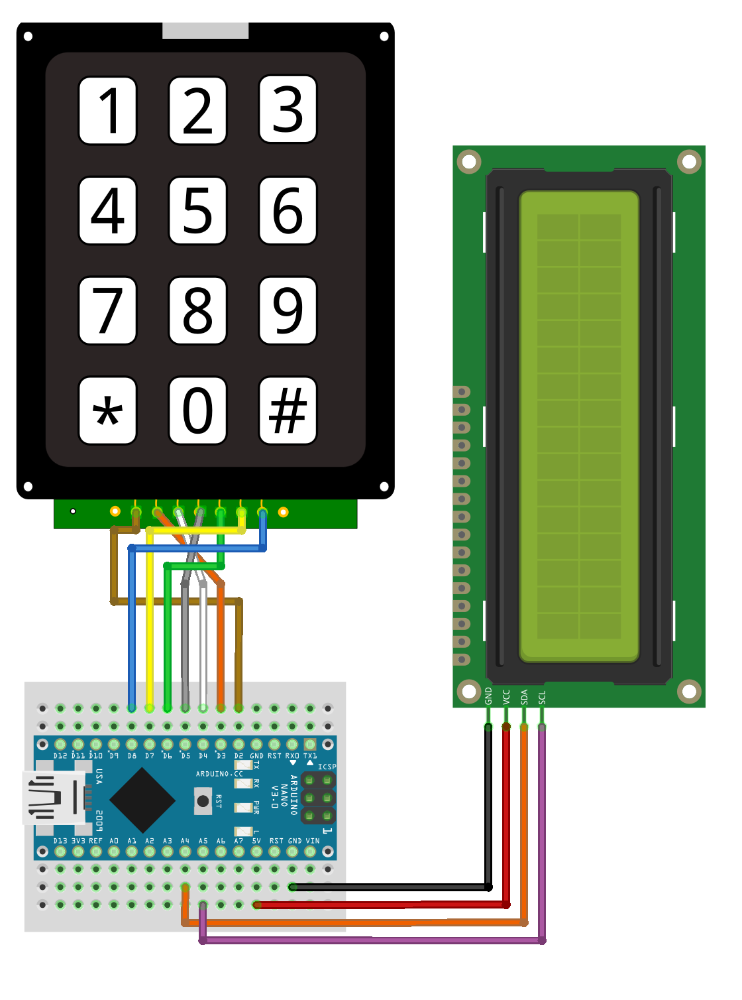
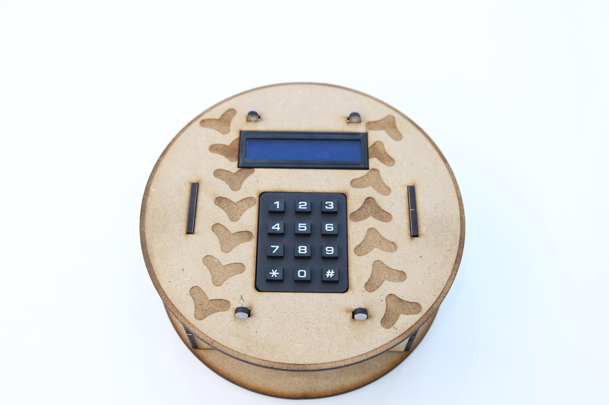

# Gongzipsa 숫자야구 키트
키패드와 1602 LCD(I2C)를 사용한 숫자야구 게임 키트

## 사용 부품
- 아두이노 나노
- 1602LCD_I2C
- 3*4 키패드

## 라이브러리
- Keypad by Mark Stanley, Alexander Brevig

## 연결
### 결선표
|아두이노 나노|3*4 키패드|1602 LCD|
|--|--|--|
|5V||VCC|
|GND||GND|
|A4||SDA|
|A5||SCL|
|D2|1||
|D3|2||
|D4|3||
|D5|4||
|D6|5||
|D7|6||
|D8|7||

### 연결 이미지

## 제품 사진

## 진행 상황
|날짜|진행사항|특이사항|
|--|--|--|
|2022/12/27|구상 시작 및 코드 작성 시작||
|2023/1/3|작성 완료||
|2023/1/6|1차 버그 수정||
|2023/1/9|2차 버그 수정 및 깃허브 업로드||
|2023/3/2|제작 완료||